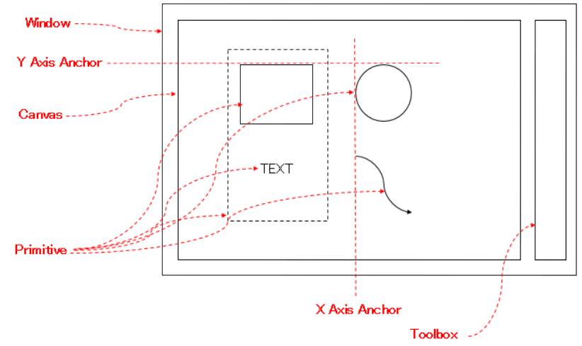

概要
====

Pandoc, Sphinx などのドキュメントビルダーを使用していると、
図もいい感じに VCS で差分管理したいという気持ちになる。

GUI でブロック図や概念図を書いて、
結果をテキストベースのファイルとして管理できると幸せ。
→ SVG エディタとして実現できるのでは？

「SVG 出力できるドローツール」だと
要素の出力順や座標指定の再現性が乏しく、
うまく差分管理することができないので、
そのあたりをいい感じにやっていきたい。

構成要素イメージ
================

アプリでやりたいこと
====================

- 描画要素を配置したい
    - SVG 要素でいうところの下記要素を配置できるようにする(それぞれの要素ごとに、どこまで対応するかは別途検討)
        - g
        - rect
        - ellipse
        - polygon
        - line
        - path(三次ベジェ曲線)
- 上下左右中央揃えしたい
- line, path の端点が、くっつけた描画要素に追随して移動するようにしたい

アプリでやらないこと
====================

- アニメーション

